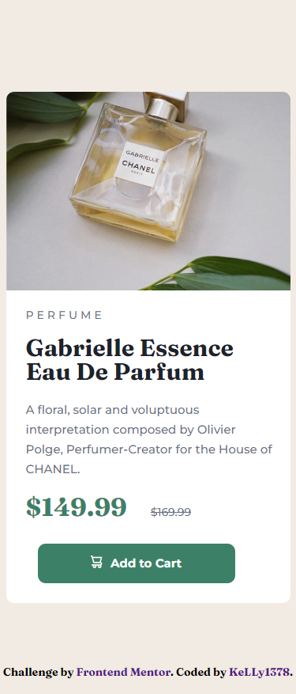

# Frontend Mentor - Product preview card component

This is a solution to the [QR code component challenge on Frontend Mentor](https://www.frontendmentor.io/challenges/product-preview-card-component-GO7UmttRfa). Frontend Mentor challenges help you improve your coding skills by building realistic projects. 

## Table of contents
- [Screenshot](#screenshot)
- [Live site](#livesite)
- [Author](#author)
### Screenshot

### Built with

- HTML5 
- CSS

## Author
- Frontend Mentor - [@KeLLy1378](https://www.frontendmentor.io/profile/KeLLy1378)
- GitHub - [@KeLLy1378](https://github.com/KeLLy1378)

## Livesite
- GitHub Pages - https://kelly1378.github.io/Product-preview-card-component-solution/
